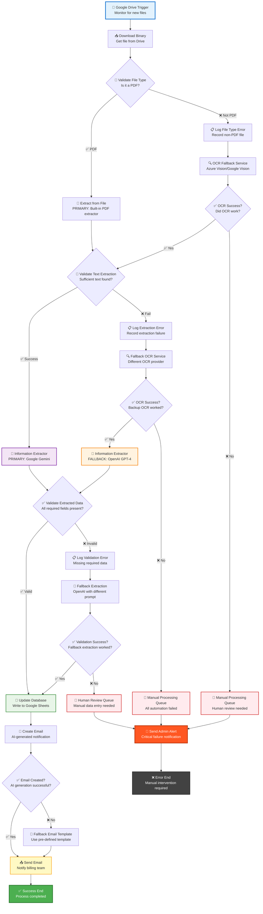

```mermaid
graph TD
    %% Main trigger and file download
    A["🔄 Google Drive Trigger<br/>Monitor for new files"] --> B["📥 Download Binary<br/>Get file from Drive"]
    
    %% File validation with fallback
    B --> C{"📄 Validate File Type<br/>Is it a PDF?"}
    C -->|"✅ PDF"| D["📖 Extract from File<br/>PRIMARY: Built-in PDF extractor"]
    C -->|"❌ Not PDF"| E["📋 Log File Type Error<br/>Record non-PDF file"]
    
    %% Non-PDF fallback path
    E --> F["🔍 OCR Fallback Service<br/>Azure Vision/Google Vision"]
    F --> G{"✅ OCR Success?<br/>Did OCR work?"}
    G -->|"✅ Yes"| H{"📝 Validate Text Extraction<br/>Sufficient text found?"}
    G -->|"❌ No"| I["👤 Manual Processing Queue<br/>Human review needed"]
    
    %% Text extraction validation with fallbacks
    D --> H
    H -->|"✅ Success"| J["🤖 Information Extractor<br/>PRIMARY: Google Gemini"]
    H -->|"❌ Fail"| K["📋 Log Extraction Error<br/>Record extraction failure"]
    
    %% Text extraction fallback chain
    K --> L["🔍 Fallback OCR Service<br/>Different OCR provider"]
    L --> M{"✅ OCR Success?<br/>Backup OCR worked?"}
    M -->|"✅ Yes"| N["🤖 Information Extractor<br/>FALLBACK: OpenAI GPT-4"]
    M -->|"❌ No"| O["👤 Manual Processing Queue<br/>All automation failed"]
    
    %% Data validation with fallbacks
    J --> P{"✅ Validate Extracted Data<br/>All required fields present?"}
    N --> P
    P -->|"✅ Valid"| Q["💾 Update Database<br/>Write to Google Sheets"]
    P -->|"❌ Invalid"| R["📋 Log Validation Error<br/>Missing required data"]
    
    %% Data extraction fallback
    R --> S["🤖 Fallback Extraction<br/>OpenAI with different prompt"]
    S --> T{"✅ Validation Success?<br/>Fallback extraction worked?"}
    T -->|"✅ Yes"| Q
    T -->|"❌ No"| U["👤 Human Review Queue<br/>Manual data entry needed"]
    
    %% Email generation with fallback
    Q --> V["📧 Create Email<br/>AI-generated notification"]
    V --> W{"✅ Email Created?<br/>AI generation successful?"}
    W -->|"✅ Yes"| X["📤 Send Email<br/>Notify billing team"]
    W -->|"❌ No"| Y["📧 Fallback Email Template<br/>Use pre-defined template"]
    Y --> X
    
    %% Success path
    X --> Z["✅ Success End<br/>Process completed"]
    
    %% Error handling and notifications
    I --> AA["🚨 Send Admin Alert<br/>Critical failure notification"]
    O --> AA
    U --> AA
    AA --> BB["❌ Error End<br/>Manual intervention required"]
    
    %% Styling for better visibility
    style A fill:#e3f2fd,stroke:#1976d2,stroke-width:3px
    style J fill:#f3e5f5,stroke:#7b1fa2,stroke-width:2px
    style N fill:#fff3e0,stroke:#f57c00,stroke-width:2px
    style Q fill:#e8f5e8,stroke:#388e3c,stroke-width:2px
    style X fill:#fff9c4,stroke:#f9a825,stroke-width:2px
    style I fill:#ffebee,stroke:#d32f2f,stroke-width:2px
    style O fill:#ffebee,stroke:#d32f2f,stroke-width:2px
    style U fill:#ffebee,stroke:#d32f2f,stroke-width:2px
    style AA fill:#ff5722,stroke:#bf360c,stroke-width:3px,color:#fff
    style BB fill:#424242,stroke:#212121,stroke-width:2px,color:#fff
    style Z fill:#4caf50,stroke:#2e7d32,stroke-width:3px,color:#fff
```
